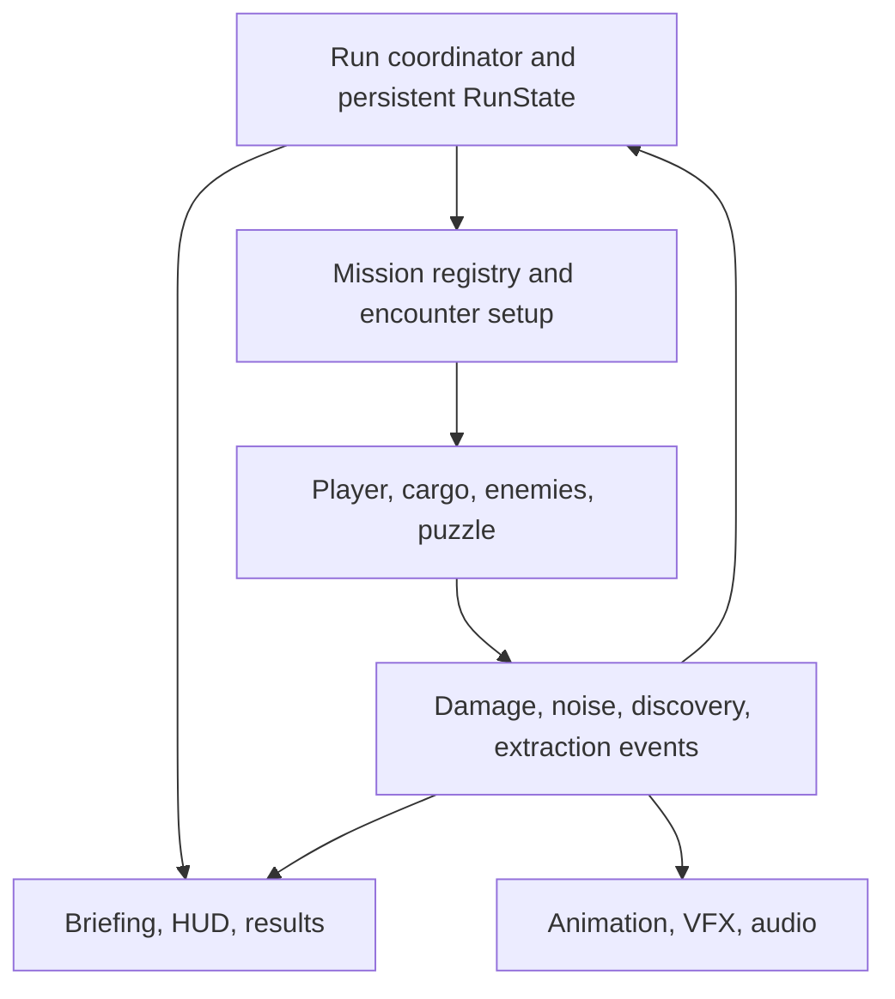

# Contaminated Recovery
## SWE402 — Phase 1: Proposal & Pre-Production

**Vertical slice:** Mission 01 — Contaminated Industrial District  
**Format:** Single-player, 2.5D action-survival extraction; one handcrafted 3D Unity mission scene  
**Target platform:** Windows PC, keyboard and mouse  
**Status:** Proposed implementation; concept art illustrates direction, not completed gameplay.

| Team member | Student ID | Primary ownership |
| --- | --- | --- |
| Ali Aloryd | 202322750 | Combat, enemy AI, detection, gameplay noise, enemy animation/VFX |
| Abdulaziz Alwarthan | 202160310 | Player/camera, cargo, mission state, persistence, integration |
| Omar Alshehri | 202177130 | Level/puzzle, UI/UX, environment/lighting, audio |

## 1. Scene definition and player journey

**Pitch.** Enter a contaminated industrial district with one of four survivors, recover vulnerable supplies, and extract. Return with another survivor using what the squad learned, while facing the consequences of earlier noise and losses.

The bunker needs medical and military supplies. The player controls **one survivor per deployment**, not a simultaneous squad. The three pillars are meaningful survivor selection, cargo that changes how the player moves and fights, and a mission that remembers discoveries and consequences. The intended experience is readable tension: choose when to fight, which route to risk, and whether to protect the survivor or pursue valuable cargo.

### Boundaries

- **Start trigger:** Select **New Run** on the Mission 01 briefing screen. Initialize four available survivors, unrecovered cargo, partial map knowledge, and LOW disturbance. Select a survivor and press **Deploy**.
- **Playable space:** One compact industrial scene containing deployment, warehouse, central yard, factory, service tunnel, puzzle platform, research room, and a separate extraction zone. The bunker is UI only.
- **Required objectives:** Extract crate A, light medical/survival supplies from the warehouse, and crate B, heavy military supplies from the factory. Carry only one objective crate at a time; extraction ends the deployment. Completion therefore requires at least two successful deployments.
- **Optional objective:** Use one weight-platform puzzle to reach crate C, rare technical equipment in the research room. The puzzle is required development scope; recovering C is optional for the player.
- **End boundary:** Once A and B are recovered, the briefing offers **Finish Mission** or another optional deployment. Finish displays **Mission 01 Complete — Mission 02 Unlocked** and ends the slice. Mission 02 is not playable.
- **Pacing target:** Approximately 5–8 minutes per deployment and 12–20 minutes for the required loop, to be adjusted after graybox playtests. There is no countdown failure condition.

### Core loop

Review known routes/threats → choose survivor → deploy → explore → fight or avoid enemies → recover cargo → manage stamina, Grip, and Condition → extract → update briefing → redeploy or finish.

Example: Scout discovers both required crates and extracts the light one. Gunfire increases disturbance near the warehouse. Heavy then uses the known route to retrieve the military crate, while an additional authored wolf patrol makes the previously disturbed sector less safe. The player can finish or risk the optional research cargo.

| Event | Deployment result and persistent consequence |
| --- | --- |
| Alive, carrying cargo with Condition above zero, inside extraction, confirm interact | Recover that cargo exactly once; remove it from later deployments; preserve discoveries and disturbance; return to briefing. |
| Alive, extract without cargo | Retreat; no cargo credit, but discoveries and disturbance remain. Survivor remains available. |
| Optional cargo reaches zero Condition | Optional recovery fails; the destroyed cargo remains unavailable for this run. Required completion is still possible. |
| Required cargo reaches zero Condition | Mark the run unwinnable. Allow escape, then show **Run Failed — Required Cargo Lost** at deployment end; offer New Run. This explicitly prevents an endless unwinnable loop. |
| Survivor health reaches zero | End deployment; mark survivor unavailable for the run; preserve discoveries, cargo state, and disturbance. Redeploy if the required objective is still achievable and a survivor remains. |
| All survivors lost before both required crates are recovered | Run Failed; New Run resets the mission. If both were already recovered, mission completion remains available. |

Extraction is an interaction, not an automatic trigger on walking past. Death takes priority over extraction within the same update; results are committed once. There is no resurrection checkpoint. Survivors who return alive receive standard health/ammunition at the next briefing; personal upgrades and bunker resource accounting are outside this slice.

## 2. Gameplay and level design

### Survivors

All four configurations share one controller and animation framework. Differences come from configuration data and weapon behavior, keeping implementation feasible for three developers.

| Survivor | Weapon | Advantage | Trade-off |
| --- | --- | --- | --- |
| Heavy | Shotgun | Highest health, carrying strength, and cargo stability | Slow movement and poor stealth |
| Scout | Pistol | Fastest movement and reduced visual detection range | Low health; heavy cargo drains Grip faster |
| Navy Soldier | Rifle | Balanced movement, stamina, health, and carrying | No specialist advantage |
| Medic Soldier | Non-lethal stun weapon | Interrupts enemies to create escape/recovery openings | Low health and limited cargo stability; cannot rely on lethal damage |

Every survivor can carry either required crate, with different penalties. Losing Heavy must not make the military crate impossible. All routes remain traversable without killing every enemy; Medic must have a viable avoidance/stun route. Ammunition and one bandage pickup type provide limited in-deployment resources.

**Controls:** WASD movement; mouse aim; left mouse fire/stun; Shift sprint; E interact/pick up/confirm extraction; Q controlled cargo drop; R reload; H use bandage; Esc pause. These are proposed bindings to be validated in Phase 2.

### Cargo rules

- Three authored objective crates: A medical/survival, B military, C technical. Each has a stable ID, weight, value label, Grip, Condition, and recovery status. Value is a result label, not a currency economy.
- Cargo weight and survivor carrying strength determine movement/aiming penalties. Carrying permits shooting with a reduced fire rate/accuracy profile; a shared carry socket avoids four unique carrying systems.
- Sprinting consumes stamina and Grip; walking stabilizes Grip; stopping restores it. At zero Grip, cargo slips, takes one defined impact penalty, and emits a noise event. Grip can recover; Condition cannot.
- Q places cargo with no Condition penalty and a small noise event. A slip creates louder noise and damage. Damage from enemies or acid reduces Condition while grounded or carried.
- Grounded drops use a short controlled Rigidbody settle, then a stable rest state. Invalid/out-of-bounds drops return to the nearest validated safe anchor without restoring Condition. Cargo cannot disappear below the map.
- Carried cargo uses its own damage hitbox. Each attack applies damage at most once to each valid target; one acid impact may damage both survivor and cargo if both are inside its hit volume.

### Mission memory and fairness

An in-memory `RunState` survives deployments during the current application session. It stores discovered area/cargo IDs, recovered or destroyed cargo, unrecovered cargo Condition and valid position, survivor availability, puzzle completion, and sector disturbance. Restarting the application starts a new run; disk saving is not required.

Immediate sound detection and persistent disturbance are separate. Gunshots and slips publish `NoiseEvent(position, radius, type, source)` for nearby enemies. Significant events also add points to the current sector. LOW/MEDIUM/HIGH thresholds select predefined encounter variants on the **next** deployment. Caps prevent endless escalation; no enemy appears beside the player as punishment. The briefing reports which sector changed and why. Enemy deaths are not persistent; each deployment rebuilds its capped encounter from the saved disturbance state. Unused resource pickups reset each deployment.

### Layout and environmental interaction

The warehouse and factory connect through the central yard. A longer perimeter/service route reduces exposure; the direct yard route is faster but dangerous; the research branch offers exploration and optional value. Use static cover, clear doorways, validated spawn anchors, and one toxic-pool hazard type. The design uses connected ground/ramp navigation, without jumping or climbing systems.

The research gate opens when a valid crate or local ballast is placed on its weight platform. After activation, the gate latches open and the puzzle flag persists, so retrieving the weight cannot trap the player. A reusable ballast object prevents the puzzle becoming impossible after the required crates have been extracted. It uses cargo interaction but is not a fourth recovery objective.

*Concept direction: final geometry will be reduced to a compact graybox. Day/Night thumbnails and decorative density are visual references; only one lighting preset is committed scope.*

## 3. Benchmark reference and deconstruction

**Target game:** *The Ascent* — Neon Giant.  
**One video reference:** [The Ascent — 12 Minutes of Next-Gen Gameplay — IGN First](https://www.youtube.com/watch?v=vcsBxA9Q2M0), IGN, 8 May 2020.  
**Comparison focus:** A bounded industrial traversal-and-combat encounter from the gameplay demonstration: approach an encounter, navigate obstacles while fighting, then proceed along the route. The video is a camera/combat/presentation reference, not a proposal to reproduce its full level or RPG.

The table defines our reproduction targets and technical choices; it does not claim access to the benchmark's source code or internal AI/physics implementation.

| System to study | What we reproduce in Mission 01 | Deliberate simplification and technical reason |
| --- | --- | --- |
| Movement and aiming | Movement independent of aiming; responsive directional gunfire | One fixed camera, keyboard/mouse, no cover-snapping or vertical aim modes; fewer control states to test |
| Camera and composition | Elevated view that shows nearby threats, cover, and route options | Fixed angle with damped follow; authored low walls/cutaways instead of complex cinematic camera changes |
| Encounter behavior | Pressure from close and ranged threats; readable attacks and recovery windows | Three shared-FSM archetypes with capped simultaneous population; no large faction/squad simulation |
| Collision and hit feedback | Solid obstacles, blocked shots, visible impacts and reliable damage | Hitscan firearms plus one acid projectile; static environment and controlled cargo physics |
| Materials and lighting | Industrial depth, contrasting focal lights, readable silhouettes | Small modular URP environment with one authored lighting state; no attempt to reproduce city-scale asset density |
| Animation and VFX | Telegraph → attack → hit/recovery feedback; weapon and impact effects | Shared humanoid rig where assets permit; short reusable effects and limited camera shake |
| Audio | Directional danger cues, distinguishable shots/impacts, ambience beneath combat | Small licensed SFX library, one ambience bed, and two music states with a simple mixer |
| HUD and interaction complexity | Essential combat state and contextual prompts remain readable during movement | Add Grip/Condition and extraction prompts; omit RPG inventory, dialogue, cyberware, and multiplayer interfaces |

Our original systems are cargo Grip/Condition, survivor risk, repeat extraction, and persistent knowledge/disturbance. Benchmark quality means comparable clarity, feedback, and integration within this small encounter—not equivalent world size or art volume. During Phase 3, compare captures of movement, encounter readability, hits, and audio cues against the reference and log concrete polish gaps.

## 4. Scope discipline

| Must-have | Nice-to-have, only after the complete loop passes | Explicitly NOT doing |
| --- | --- | --- |
| One industrial mission; briefing/results UI; distinct deployment/extraction; two required crates and one optional crate | A second authored Night lighting/ambience preset | Playable Mission 02, campaign, open world, explorable bunker |
| Four data-driven survivors; movement/aiming, health, sprint/stamina, three firearms and Medic stun | Additional validated spawn combinations | Multiplayer, co-op squad control, vehicles, free camera, platforming |
| Pickup/drop, weight penalties, Grip/Condition, limited ammo and bandages; one weight-platform puzzle | Richer map discovery display | Crafting, economy, skill tree, character upgrades, disk/cloud saving |
| Shared FSM; wolf, armored creature, spitter; sight/sound; one toxic-pool hazard; three route choices | Extra cosmetic survivor animation differences | More enemies, bosses, more puzzles/hazard types, procedural maps, full destruction |
| Session-persistent knowledge, cargo, deaths, puzzle flag; one visible sector disturbance consequence | Additional authored patrol variations within the same population cap | Continuous day/night cycle, complex dynamic extraction, arbitrary spawn coordinates |
| HUD/prompts, materials/lighting, animation/VFX/camera, spatial audio/music/mixing, profiling and stability evidence, reviewed GitHub workflow | Additional decoration once frame-time targets pass | Custom art production at the scale depicted by the concept sheets |

**Content budget:** three objective crates, one reusable ballast, one puzzle, three enemy archetypes, four configurations of the same player framework, and an initial maximum of six simultaneously active enemies. Enemy count is a tuning ceiling to validate, not measured capacity. No new feature enters Must-have without removing comparable work and updating the issue plan.

**Cut order if behind:** Night preset → random/patrol variants → decorative density → cosmetic animation differences. Preserve the four choices, cargo mechanics, two-deployment loop, knowledge, one disturbance consequence, and extraction. Use licensed placeholder/model assets before considering new content. If required scope still exceeds capacity, raise a documented scope decision with the instructor before the checkpoint.

## 5. Technical plan and competency integration

### Toolchain and architecture

Use **Unity 6 with C#, URP, Input System, Cinemachine, AI Navigation, Animator, Unity UI/TextMeshPro, and AudioMixer**. This is the proposed stack; the baseline task locks one team-compatible editor patch and package versions in `ProjectVersion.txt`, `manifest.json`, and `packages-lock.json`. No version upgrade during a phase without a reviewed migration. VS Code, Git/GitHub, and the Unity Profiler support development. Use original or appropriately licensed assets and keep an asset-credit register.

`CharacterData`, `CargoData`, `WeaponData`, and `EnemyData` ScriptableObjects store configuration. Mutable run progress belongs to a separate runtime model, not the shared configuration assets. [Unity documents this distinction for deployed builds](https://docs.unity3d.com/6000.2/Documentation/Manual/class-ScriptableObject.html).

Stable IDs connect runtime objects to saved run entries. The coordinator rebuilds the same scene from those entries when redeploying. Event subscribers handle display/sound; UI never becomes the authority for objective completion. Separate event payloads and interfaces such as `IDamageable` and `IInteractable` reduce cross-team coupling.

| Course competency | Planned implementation and integration | Evidence of completion |
| --- | --- | --- |
| **Core gameplay systems engineering** | Shared controller; `Briefing`, `Deploying`, `Active`, `Results`, `Complete`, `Failed` states; pause only within Active. Extraction checks alive/cargo state, commits results once, and returns to briefing. | Start-to-finish capture including two deployments; empty extraction, cargo failure, and death cases |
| **Physics and collision systems** | CharacterController with explicit gravity/grounding; masked raycasts for cursor aim, line of sight, and hitscan; swept acid collision; controlled cargo Rigidbody settle; trigger validation for puzzle/extraction. Knockback is a bounded controller displacement. | Wall/corner tests, no shooting through cover, one damage application per attack, stable drops, no invalid extraction |
| **AI behavior design** | Shared FSM: Patrol → Investigate → Chase/Position → Attack → Search → Return, with Stunned/Dead interrupts. NavMesh navigation and sight-ray occlusion; separate hearing events. Wolf investigates then bites; armored creature telegraphs heavy attack/knockback; spitter repositions to range and fires acid. | One documented scenario for each archetype, sight/sound tests, stun/recovery and unreachable-target handling |
| **Real-time graphics pipeline** | URP, modular PBR materials, baked/static lighting where practical, bounded dynamic shadows, restrained fog, contrast around routes/objectives. Art replacement preserves navigation and collision footprints. | Gameplay captures with threats/cargo readable at the final camera distance |
| **Technical art and polish** | Animator states for locomotion/carry/attack/hit/death; attack events define hit windows; acid, stun, muzzle flash, impact VFX; damped Cinemachine camera, limited shake, restrained post-processing. | Telegraph and hit timing match damage; player remains visible through all routes; shared rig/carry pose validated |
| **Audio systems design** | Separate Master/SFX/Music/Ambience mixer groups; event-driven gunshot, bite, stun, acid, cargo, UI, and result sounds; spatial enemy/impact audio; crossfade calm/combat music. Gameplay noise events do not depend on actual speaker volume. | Muting sound does not disable AI hearing; mixer test; threat direction audible and UI cues distinct |
| **UI/UX feedback** | Health, stamina, ammo, Grip, Condition, objective count and interaction prompts; clear controlled-drop/slip feedback; briefing shows known routes/cargo, survivor availability and changed disturbance; explicit results/restart. | A new tester can identify the goal, pick up/drop cargo, extract, and explain one persistent change without coaching |
| **Performance optimization and debugging** | Profile a standalone Development Build; record CPU/GPU frame time, allocations, memory, AI and rendering costs on a named team PC. Investigate measured bottlenecks before adding pooling/culling or reducing shadows/effects. | Before/after profiling captures tied to build commits; repeatable stress route; no unresolved crash/softlock issues |
| **Production and collaboration practices** | Issues with owners/acceptance criteria/dependencies; Project statuses; feature branches; reviewed PRs; phase tags; prefab/scene ownership; asset credits and reproducible setup/build instructions. | Board matches actual state; reviewed PR history; tagged phase files and later build artifacts |

CharacterController movement must explicitly apply gravity; [`Move` does not do so automatically](https://docs.unity3d.com/6000.0/Documentation/ScriptReference/CharacterController.Move.html). “Deterministic interactions” here means controlled, repeatable gameplay rules and single-event resolution, not a claim that Unity physics is bitwise deterministic across computers.

**Example integration:** Sprint depletes Grip → the carrier releases cargo → a single impact reduces Condition and emits noise → nearby wolves investigate → sector disturbance accumulates → HUD/VFX/audio explain the event → extraction commits the changed state → the next briefing names the disturbed sector → the next deployment uses its authored encounter variant.

## 6. Production plan and ownership

### GitHub Project board plan

Create one team repository and one Project named **Contaminated Recovery — SWE402**. The board is planned, not represented as already created in this package. Use **Backlog → Ready → In Progress → Review → Testing → Done**, with Phase, Priority, Owner, Reviewer, Estimate, and Dependency fields. Labels: `gameplay`, `cargo`, `ai`, `level`, `ui`, `art-audio`, `bug`, `documentation`.

Each row below becomes an issue, retaining its planning ID in the title. IDs are not existing GitHub issue numbers. Start with one active implementation issue per member; split any issue exceeding eight focused hours. Estimates are provisional focused person-hours, not promised calendar dates. Set actual due dates to the instructor's schedule at kickoff.

| ID / phase | Actionable task | Owner / reviewer | Depends on | Acceptance criteria | Hours |
| --- | --- | --- | --- | --- | --- |
| P1-01 / 1 | Review proposal, benchmark and scope | Abdulaziz / Ali | — | All names/IDs and rubric sections checked; three members agree on committed scope | 2 |
| P1-02 / 1 | Prepare repository, board and review rules | Ali / Omar | P1-01 | README/contribution/PR files present; tasks entered and assigned; no direct feature commits to main | 3 |
| P1-03 / 1 | Establish Unity baseline and asset register | Omar / Abdulaziz | P1-01 | Version/package lock committed; empty URP project opens for all three; asset sources recorded | 3 |
| P2-01 / 2 | Graybox all routes and safe anchors | Omar / Ali | P1-03 | Deployment, A/B/C, puzzle and extraction are reachable; alternate route avoids armored guard | 6 |
| P2-02 / 2 | Implement movement, aim and camera | Abdulaziz / Omar | P1-03 | All routes traversable; wall collisions hold; aiming/camera remain stable at corners | 6 |
| P2-03 / 2 | Implement health, weapons and damage | Ali / Abdulaziz | P2-02 | Pistol/rifle/shotgun differ; reload/ammo work; shots stop at cover; no duplicate damage | 6 |
| P2-04 / 2 | Implement cargo, Grip and stamina | Abdulaziz / Ali | P2-02 | Pick up, sprint, slip, controlled drop and acid damage update correct values; safe-drop recovery works | 8 |
| P2-05 / 2 | Implement briefing, HUD and results shell | Omar / Abdulaziz | P2-02 | Four choices and all HUD fields display authoritative values; prompts and pause work | 5 |
| P2-06 / 2 | Build FSM, perception, noise and wolf | Ali / Omar | P2-01, P2-03 | Wolf patrols, hears, investigates, chases, bites, searches and returns; walls block sight | 8 |
| P2-07 / 2 | Implement run/extraction state | Abdulaziz / Omar | P2-04, P2-05 | Two required recoveries complete mission; empty retreat/death/cargo loss resolve exactly once | 8 |
| P2-08 / 2 | Add armored enemy and Medic stun | Ali / Abdulaziz | P2-06 | Telegraph/knockback/resistance work; stun interrupts and recovers; bypass route remains possible | 5 |
| P2-09 / 2 | Build latched weight-platform puzzle | Omar / Ali | P2-01, P2-04 | Crate/ballast opens gate; removal cannot trap player; puzzle works after A/B recovery | 4 |
| P2-10 / 2 | Add spitter and acid collision | Ali / Omar | P2-06, P2-04 | Spitter maintains range; acid is blocked by cover and damages valid player/cargo hitboxes once | 5 |
| P2-11 / 2 | Add knowledge and disturbance persistence | Abdulaziz / Ali | P2-06, P2-07 | Discoveries, cargo/deaths/gate state survive redeploy; gunfire activates one later patrol variant | 6 |
| P2-12 / 2 | Add base SFX/music and resources/hazard feedback | Omar / Ali | P2-05, P2-06 | Mixer controls work; pickups/hazard are readable; AI noise survives muted audio | 6 |
| P2-13 / 2 | Configure/balance four survivor profiles | Abdulaziz / Omar | P2-03, P2-04, P2-08 | Each has a distinct advantage; all can extract A/B; Medic can complete a route without kills | 4 |
| P2-14 / 2 | Run fresh-player checkpoint playtest | Omar / Abdulaziz | P2-09–P2-13 | At least two outside testers; issues record severity/repro steps; team verifies win/fail paths | 4 |
| P2-15 / 2 | Fix blockers and tag checkpoint build | Abdulaziz / Ali | P2-14 | Clean-clone build launches; critical issues fixed/retested; report and build linked to phase2 tag | 4 |
| P3-01 / 3 | Replace graybox and tune lighting | Omar / Abdulaziz | P2-15 | All routes/colliders preserved; key objectives readable; asset credits complete | 8 |
| P3-02 / 3 | Polish attacks, animation and VFX | Ali / Omar | P2-15 | Three enemies have readable attack/recovery cues; damage and effects stay synchronized | 8 |
| P3-03 / 3 | Polish carry/camera and collision edge cases | Abdulaziz / Ali | P2-15 | No camera obstruction or reproducible cargo clipping on the test routes | 6 |
| P3-04 / 3 | Mix audio and refine UI accessibility | Omar / Ali | P3-01, P3-02 | Spatial threats, mix, prompts and HUD remain clear under combat load | 6 |
| P3-05 / 3 | Profile and fix measured bottlenecks | Abdulaziz / Omar | P3-01–P3-04 | Recorded hardware/build/route and before/after metrics; no sustained memory growth | 6 |
| P4-01 / 4 | Regression and release candidate | Ali / Abdulaziz | P3-05 | Full regression pass, blocker triage and fresh-machine launch evidence | 6 |
| P4-02 / 4 | Package build and technical documentation | Abdulaziz / Omar | P4-01 | Reproducible setup, controls, build steps and tagged release archive | 4 |
| P4-03 / 4 | Record fallback demo and prepare presentation | Omar / Ali | P4-01 | Short demo shows both deployments and consequence; all three explain owned systems and contribute to postmortem | 4 |

Ownership is accountability, not isolation. Each owner fixes defects in their area; the named reviewer checks integration. Omar controls the shared scene file while Ali and Abdulaziz work in prefabs/scripts. Abdulaziz coordinates integration, but all three build and test. Compare workload during the weekly board review and rebalance explicitly.

### Milestone sequence

1. **Phase 1 — plan/baseline:** Agree scope, lock tools, prepare repository/board, review proposal; tag `phase1` after teammate approval.
2. **Phase 2A — movement/blockout:** P2-01–P2-03. Gate: movement, routes and damage work.
3. **Phase 2B — first complete extraction:** P2-04–P2-07. Gate: one crate can be carried, lost or extracted through briefing/results.
4. **Phase 2C — identity and challenge:** P2-08–P2-13. Gate: four choices, three enemies, puzzle, persistent information and consequence work together.
5. **Phase 2 checkpoint:** P2-14–P2-15. Freeze features, playtest, fix blockers, release `phase2`.
6. **Phase 3 — presentation/optimization:** Art, animation/VFX, audio, camera, usability and measured performance; tag `phase3`.
7. **Phase 4 — delivery:** Regression, final build/documentation, presentation/demo and postmortem; tag `phase4`.

Reserve approximately 20% of available phase time for integration and defect repair. Nice-to-have work starts only after checkpoint acceptance. The sequence follows the four-phase project description supplied for this proposal; calendar deadlines follow course announcements.

### Phase 2 checkpoint acceptance

- [ ] A clean run completes A then B through at least two deployments, ending at Mission 01 Complete.
- [ ] Four selectable survivors have functional differences using one controller; dead survivors cannot redeploy.
- [ ] Cargo weight, Grip, Condition, controlled drop, slip and carry penalties work with visible feedback.
- [ ] A discovered cargo/route remains known; a recovered crate stays removed; one noise-caused patrol change is visible next deployment.
- [ ] Wolf hearing/investigation/bite, armored attack/stun, and ranged acid damaging cargo all work.
- [ ] All three routes, cover, resource pickups, toxic hazard, and the research weight puzzle work in graybox.
- [ ] HUD, briefing/results, prompts, base spatial SFX and first-pass music are usable.
- [ ] Empty retreat, destroyed required cargo, optional cargo loss, survivor death, all-survivor loss, pause and New Run have defined tested results.
- [ ] Two outside playtests produce a report and prioritized fixes; fresh-clone build instructions work.
- [ ] Board status is current; reviewed PRs and a tagged `phase2` playable build provide evidence.

## 7. Risks, testing and quality gates

| Risk / early signal | Response | Owner |
| --- | --- | --- |
| Too much content; tasks repeatedly exceed eight hours | Split tasks, enforce content budget, cut optional variation before core mechanics | Abdulaziz |
| Persistence softlocks or duplicates recovered cargo | Stable IDs; a single result commit; test death/extraction races and two complete redeployments | Abdulaziz |
| Cargo falls through geometry or triggers repeated damage | Safe-drop anchors, controlled settle, per-attack target filtering; no uncontrolled stacking puzzle | Abdulaziz |
| AI cannot navigate or disturbance feels unfair | Validate NavMesh/anchors, cap agents, retain alternate route; telegraph attacks and report sector changes | Ali |
| Medic or surviving characters cannot finish | Require bypass/stun path; heavy crate is slower, never forbidden, for other survivors | Ali |
| Art obscures routes or delays implementation | Graybox gates first; modular licensed assets; camera-readability review before adding decoration | Omar |
| Scene merge conflicts | One scene editor at a time; prefab ownership; text serialization and tracked .meta files | Omar |
| Performance drops in combat | Reproduce six-enemy stress case; profile CPU/GPU and change measured hotspots | Abdulaziz |
| Asset permissions/version mismatch | Record provenance/license; lock editor/packages and perform clean-clone checks | Omar |

**Performance target, not a measured result:** Aim for 60 FPS at 1920×1080 on a designated team Windows PC, with steady-state 95th-percentile frame time at or below 16.7 ms in the representative encounter. Record CPU/GPU/RAM, resolution, quality, build hash and the exact test route before reporting results. Capture a standalone Development Build for diagnosis and check the release build for player experience. Use [Unity Profiler](https://docs.unity3d.com/6000.5/Documentation/Manual/Profiler.html); separate loading spikes from gameplay and inspect memory across five redeployments.

Testing combines focused rule checks for state transitions, extraction idempotency and disturbance thresholds with in-scene checks for collision, aiming, navigation, audio and camera. Mandatory regressions include destroyed required cargo, gate activation followed by weight removal, death while carrying, extraction without cargo, recovered-crate removal, muted-audio hearing, and New Run reset. Record failures with build hash, steps, expected/actual behavior and severity. No crash, progression blocker, missing objective, or reproducible softlock may remain open at a phase release.

**Definition of Done:** Issue acceptance criteria pass; owner supplies evidence; a teammate reviews the PR; integration smoke test passes; relevant documentation/credits update; board moves to Done only after merge and verification. Use `feature/<issue>-<name>` branches, meaningful commits, PR links to issues, and at least one teammate approval. Do not commit features directly to `main`.

## 8. Visual direction and source basis

*AI-generated concept sheets support visual discussion. Their labels/stat bars are illustrative, not finalized balance values, production assets, or screenshots of an implemented build. This proposal controls scope where an illustration implies extra content.*

This proposal consolidates the supplied `proposal(1).md`, `Game_Foundation_2.5D_Revised.pdf`, and `image prompt.md`. It preserves the foundation's defining systems while limiting the course build to one scene. Personal progression, extra missions and expanded systems remain outside the semester commitment.

**Course references:** [Phase 1 requirements and rubric](https://github.com/gamedevkfupm/swe402/blob/main/project/Phase1_Proposal_Description.md) · [Full project description](https://github.com/gamedevkfupm/swe402/blob/main/project/project_description.md). Requirements checked 27 September 2026.

**Repository support:** [README](../../README.md) · [Contribution rules](../../CONTRIBUTING.md) · [Submission checklist](submission-checklist.md). The required assessed proposal is this file at `docs/phase1/proposal.md`; the companion files support repository setup and submission.
